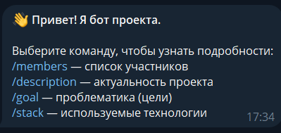
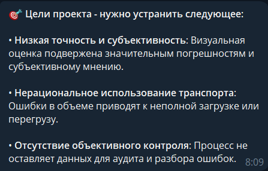

# Техническое руководство: Разработка Telegram-бота для презентации проекта на Python

> **Цель документа:** Пошаговое руководство по созданию Telegram-бота для представления информации о проекте. Документ описывает исследование предметной области, архитектуру, реализацию функционала и процесс документирования.

---

# 1. Исследование предметной области

## Ключевые вопросы исследования

### 1. Какие компоненты обязательны для Telegram-бота проекта?

- Подключение к Telegram Bot API
- Система обработки пользовательских команд
- Хранение токена в переменных окружения
- Отправка форматированных сообщений
- Разделение информации по категориям команд
- Поддержка Markdown-разметки
- Бесконечный цикл polling для работы бота

### 2. Почему выбран pyTelegramBotAPI (telebot)?

- Простота использования и минимальный объём кода
- Быстрая настройка команд и обработчиков
- Поддержка Markdown и HTML-разметки
- Большое количество примеров и документации
- Подходит для учебных и демонстрационных проектов
- Совместимость с Python 3.10+

### 3. Анализ аналогов

Изучены Telegram-боты для образовательных и проектных команд. Выделены требования:

- Быстрый доступ к информации через команды
- Простота интерфейса без сложных меню
- Поддержка мобильных устройств
- Возможность расширения функционала

---

## Сравнение библиотек для Telegram-ботов

| Библиотека | Сложность | Производительность | Гибкость | Подходит для проекта |
|---|---|---|---|---|
| pyTelegramBotAPI (telebot) | Низкая | Высокая | Средняя | Да |

---

# 2. Подготовка окружения

## Требования

- Python 3.10 или выше
- Telegram-аккаунт
- Токен Telegram-бота от BotFather
- Git для контроля версий (рекомендуется)

---

## Установка библиотеки

```bash
pip install pyTelegramBotAPI
```

---

## Проверка установки

```bash
python --version
pip show pyTelegramBotAPI
pip show python-dotenv
```

---

## Создание файла `.env`

```env
BOT_TOKEN=your_telegram_bot_token
```

> **Примечание:** Никогда не публикуйте токен бота в открытом доступе или GitHub-репозитории.

---

# 3. Пошаговая реализация

## Шаг 1: Подключение библиотек и загрузка токена

```python
import os
import telebot
from dotenv import load_dotenv

load_dotenv()

bot = telebot.TeleBot(os.getenv('BOT_TOKEN'))
```

---

## Шаг 2: Создание обработчика команд

```python
@bot.message_handler(commands=['start', 'members', 'description', 'goal', 'stack'])
def handle_commands(message):
```

### Назначение обработчика

- Перехватывает команды пользователя
- Анализирует введённую команду
- Формирует текст ответа
- Отправляет сообщение обратно пользователю

---

## Шаг 3: Реализация стартового сообщения

```python
if message.text == '/start':
    text = (
        "👋 *Привет! Я бот проекта.*\n\n"
        "Выберите команду, чтобы узнать подробности:\n"
        "/members — список участников\n"
        "/description — актуальность проекта\n"
        "/goal — проблематика (цели)\n"
        "/stack — используемые технологии"
    )
```


*Рис. 1. Приветствие от бота.*

### Особенности реализации

- Используется Markdown-разметка
- Команды отображаются в виде списка
- Эмодзи улучшают восприятие интерфейса
- Пользователь получает навигацию по функционалу

---

## Шаг 4: Реализация команды списка участников

```python
    elif message.text == '/members':
        text = (
            "👥 *Список участников проекта:*\n\n"
            "1. *Алиханов Богдан Тагирович* (241-333)\n2. *Алхедеров Омар* (241-337)\n"
            "3. *Бондаренко Кирилл Андреевич* (241-131)\n4. *Бортникова Дарина Артуровна* (241-336)\n"
            "5. *Гильдеева Виктория Сергеевна* (251-333)\n6. *Грехова Дарья Кирилловна* (251-334)\n"
            "7. *Гылычджанова Боссан* (251-622)\n8. *Дубинкин Антон Владимирович* (251-339)\n"
            "9. *Коваль Александр Евгеньевич* (251-331)\n10. *Леонтьев Александр Александрович* (251-331)\n"
            "11. *Майкова Елизавета Анатольевна* (251-334)\n12. *Мокшин Кирилл Александрович* (241-132)\n"
            "13. *Останин Платон Валерьевич* (251-336)\n14. *Островерхова Елена Олеговна* (251-621)\n"
            "15. *Пинчук Ренат Сергеевич* (241-132)\n16. *Полковникова Арина Александровна* (251-621)\n"
            "17. *Сулейманов Эмиль Шамилевич* (241-132)\n18. *Федоров Иван Сергеевич* (251-333)\n"
            "19. *Хомидов Дилшоджон Шерзодович* (251-337)\n20. *Хоруженко Дмитрий Андреевич* (251-337)"
        )
```

*Рис. 2. Список участников.*

### Технические детали

- Информация хранится непосредственно в коде
- Форматирование выполняется через Markdown
- Каждая запись выводится отдельной строкой
- Поддерживается кириллица UTF-8

---

## Шаг 5: Реализация информационных разделов

### Команда `/description`

```python
elif message.text == '/description':
    text = (
        "📝 *Актуальность проекта*\n\n"
        "Использование нейронной сети..."
    )
```

### Команда `/goal`

```python
elif message.text == '/goal':
    text = (
        "🎯 *Цели проекта*\n\n"
        "• *Низкая точность и субъективность*..."
    )
```

### Команда `/stack`

```python
elif message.text == '/stack':
    text = (
        "🛠 *Стек используемых технологий:*\n\n"
        "• *PyTorch*\n"
        "• *YOLOv8*\n"
        "• *OpenCV*"
    )
```

---

## Шаг 6: Отправка сообщений пользователю

```python
bot.send_message(
    message.chat.id,
    text,
    parse_mode="Markdown"
)
```

### Технические детали

- `message.chat.id` определяет получателя
- `parse_mode="Markdown"` включает форматирование
- Бот отвечает в том же чате, где получил команду

---

## Шаг 7: Запуск бота

```python
if __name__ == "__main__":
    print("✅ Бот запущен...")
    bot.infinity_polling()
```

### Назначение

- Проверка запуска файла напрямую
- Вывод сообщения в консоль
- Бесконечный цикл обработки сообщений

---

# 4. Архитектура приложения

## Структура Telegram-бота

```text
TelegramProjectBot
├── Импорт библиотек
│   ├── os — работа с переменными окружения
│   ├── telebot — Telegram Bot API
│   └── dotenv — загрузка .env
│
├── Конфигурация
│   ├── load_dotenv()
│   ├── BOT_TOKEN
│   └── bot = TeleBot(...)
│
├── Обработчики команд
│   ├── /start — стартовое сообщение
│   ├── /members — список участников
│   ├── /description — актуальность проекта
│   ├── /goal — цели проекта
│   └── /stack — используемые технологии
│
├── Отправка сообщений
│   └── bot.send_message()
│
└── Основной цикл
    ├── print()
    └── bot.infinity_polling()
```

---

## Диаграмма последовательности: Обработка команды

```text
Пользователь -> Telegram: Отправка команды /stack
Telegram -> Bot API: Передача сообщения
Bot API -> TelegramProjectBot: message object
TelegramProjectBot -> handle_commands(): Проверка команды
handle_commands() -> TelegramProjectBot: Формирование текста
TelegramProjectBot -> Bot API: send_message()
Bot API -> Пользователь: Отправка ответа
```

---

# 5. Ключевые модификации

## Модификация 1: Система обработки команд

### Задача

Обеспечить быстрый доступ к разделам информации через Telegram-команды.

### Реализация

```python
@bot.message_handler(commands=['start', 'members'])
def handle_commands(message):
```

### Технические детали

- Обработка выполняется через условные конструкции `if/elif`
- Один обработчик обслуживает несколько команд
- Поддерживается расширение функционала

---

## Модификация 2: Использование Markdown-разметки

### Задача

Сделать сообщения более читаемыми и структурированными.

### Реализация

```python
bot.send_message(
    message.chat.id,
    text,
    parse_mode="Markdown"
)
```

### Технические детали

- Жирный текст выделяется через `*текст*`
- Поддерживаются эмодзи Unicode
- Списки формируются символами `•`
- Telegram автоматически форматирует сообщение

---

## Модификация 3: Хранение токена через `.env`

### Задача

Повысить безопасность хранения конфиденциальных данных.

### Реализация

```python
from dotenv import load_dotenv
load_dotenv()

bot = telebot.TeleBot(os.getenv('BOT_TOKEN'))
```

### Технические детали

- Токен не хранится напрямую в коде
- Используется переменная окружения
- Упрощается перенос проекта между устройствами
- Исключается случайная публикация токена

---

# 6. Доп. инструменты

## Добавление новых команд

Для расширения функционала можно добавить команды:

- `/contacts` — контакты команды
- `/help` — список всех команд
- `/news` — новости проекта
- `/demo` — ссылка на демонстрацию

---

## Поддержка кнопок Telegram

Пример клавиатуры:

```python
from telebot import types

markup = types.ReplyKeyboardMarkup(resize_keyboard=True)
markup.add("/members", "/stack")

bot.send_message(message.chat.id, "Выберите команду:", reply_markup=markup)
```

---

## Логирование действий

```python
print(f"Получена команда: {message.text}")
```

Позволяет отслеживать активность пользователей в консоли.

---

# 7. Тестирование и запуск

## Инструкция по запуску

```bash
git clone <repository-url>
cd telegram-project-bot
python main.py
```

---

## Чек-лист функционального тестирования

- [ ] Бот запускается без ошибок
- [ ] Команда `/start` отображает список доступных команд
- [ ] Команда `/members` выводит список участников
- [ ] Команда `/description` показывает актуальность проекта
- [ ] Команда `/goal` отображает цели проекта
- [ ] Команда `/stack` выводит стек технологий
- [ ] Markdown-разметка отображается корректно
- [ ] Бот корректно работает с кириллицей
- [ ] `.env` корректно загружается
- [ ] Бот отвечает без задержек

---

## Известные ограничения

- Отсутствует база данных
- Нет системы авторизации пользователей
- Команды реализованы через `if/elif`
- Бот работает только в режиме polling
- Нет обработки ошибок Telegram API

---

# 8. Хронология работы и индивидуальные планы

## Этапы реализации (Февраль – Май 2026)

| Период | Задача | Результат |
|---|---|---|
| 03.02 – 15.02 | Исследование Telegram Bot API | Изучение библиотеки telebot |
| 16.02 – 01.03 | Настройка окружения и подключение бота | Рабочий шаблон проекта |
| 02.03 – 20.03 | Реализация команд и логики | Полностью рабочий бот |
| 21.03 – 15.04 | Тестирование и исправление ошибок | Стабильная версия |
| 16.04 – 12.05 | Подготовка документации | Готовый отчёт и код |

---

## Индивидуальные планы участников

| Участник                     | Роль                   | Ключевые задачи |
|------------------------------|------------------------|---|
| Гильдеева Виктория Сергеевна | Ведущий разработчик    | Реализация Telegram-бота, настройка API, обработка команд |
| Федоров Иван Сергеевич       | Аналитик / Тестировщик | Тестирование функционала, документация, анализ требований |

---

# 9. Полезные ресурсы

1. https://pytba.readthedocs.io/  
2. https://core.telegram.org/bots/api  
3. https://pypi.org/project/python-dotenv/  
4. https://docs.python.org/3/  
5. https://git-scm.com/doc  

---

# 10. Остальная информация
Проект разработан в рамках учебной проектной практики. Исходный код предоставляется для ознакомления и внутреннего использования командой проекта.

**Контактное лицо:** Семенова Валерия Валерьевна  

**Организация-партнёр:** Автоматизированная информационная система для транспортной компании

**Дата завершения практики:** 12 мая 2026 г.
